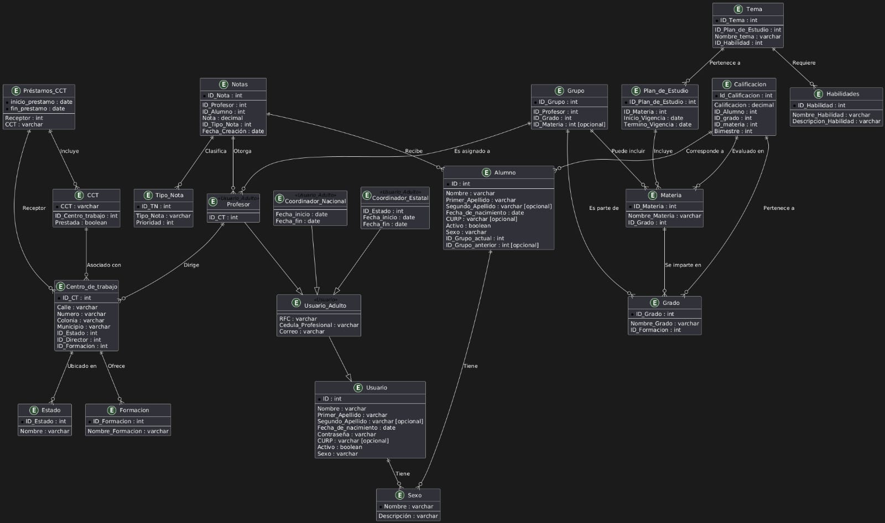
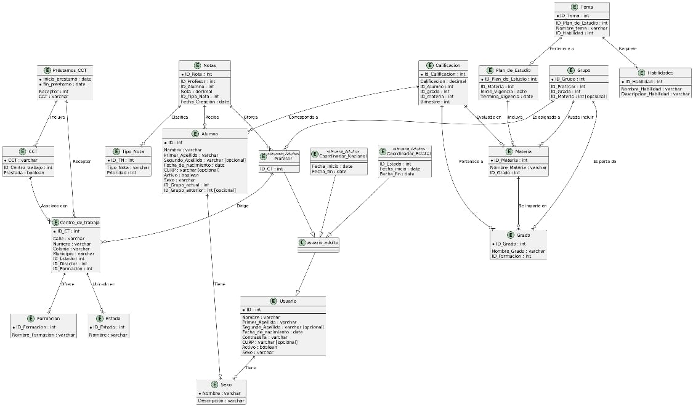

# Notas y control de la base de datos




## Codigo de la base de datos

```sql

-- Crear la base de datos
CREATE DATABASE IF NOT EXISTS EscuelaDB;
USE EscuelaDB;

-- Tabla Sexo
CREATE TABLE Sexo (
    Nombre VARCHAR(50) PRIMARY KEY,
    Descripcion VARCHAR(255)
);

-- Tabla Usuario
CREATE TABLE Usuario (
    ID INT PRIMARY KEY AUTO_INCREMENT,
    Nombre VARCHAR(50) NOT NULL,
    Primer_Apellido VARCHAR(50) NOT NULL,
    Segundo_Apellido VARCHAR(50),
    Fecha_de_nacimiento DATE NOT NULL,
    Contraseña VARCHAR(255) NOT NULL,
    CURP VARCHAR(18),
    Activo BOOLEAN NOT NULL,
    Sexo VARCHAR(50),
    FOREIGN KEY (Sexo) REFERENCES Sexo(Nombre)
);

-- Tabla Usuario_Adulto (hereda de Usuario)
CREATE TABLE Usuario_Adulto (
    ID INT PRIMARY KEY AUTO_INCREMENT,
    RFC VARCHAR(20),
    Cedula_Profesional VARCHAR(20),
    Correo VARCHAR(100),
    FOREIGN KEY (ID) REFERENCES Usuario(ID)
);

-- Tabla Alumno
CREATE TABLE Alumno (
    ID INT PRIMARY KEY AUTO_INCREMENT,
    Nombre VARCHAR(50) NOT NULL,
    Primer_Apellido VARCHAR(50) NOT NULL,
    Segundo_Apellido VARCHAR(50),
    Fecha_de_nacimiento DATE NOT NULL,
    CURP VARCHAR(18),
    Activo BOOLEAN NOT NULL,
    Sexo VARCHAR(50),
    ID_Grupo_actual INT NOT NULL,
    ID_Grupo_anterior INT,
    FOREIGN KEY (Sexo) REFERENCES Sexo(Nombre),
    FOREIGN KEY (ID_Grupo_actual) REFERENCES Grupo(ID_Grupo),
    FOREIGN KEY (ID_Grupo_anterior) REFERENCES Grupo(ID_Grupo)
);

-- Tabla Profesor (hereda de Usuario_Adulto)
CREATE TABLE Profesor (
    ID_CT INT,
    FOREIGN KEY (ID_CT) REFERENCES Centro_de_trabajo(ID_CT),
    PRIMARY KEY (ID_CT)
);

-- Tabla Coordinador Nacional (hereda de Usuario_Adulto)
CREATE TABLE Coordinador_Nacional (
    Fecha_inicio DATE,
    Fecha_fin DATE,
    ID INT PRIMARY KEY AUTO_INCREMENT,
    FOREIGN KEY (ID) REFERENCES Usuario_Adulto(ID)
);

-- Tabla Coordinador Estatal (hereda de Usuario_Adulto)
CREATE TABLE Coordinador_Estatal (
    ID_Estado INT,
    Fecha_inicio DATE,
    Fecha_fin DATE,
    ID INT PRIMARY KEY AUTO_INCREMENT,
    FOREIGN KEY (ID) REFERENCES Usuario_Adulto(ID),
    FOREIGN KEY (ID_Estado) REFERENCES Estado(ID_Estado)
);

-- Tabla Estado
CREATE TABLE Estado (
    ID_Estado INT PRIMARY KEY AUTO_INCREMENT,
    Nombre VARCHAR(100)
);

-- Tabla Centro de trabajo
CREATE TABLE Centro_de_trabajo (
    ID_CT INT PRIMARY KEY AUTO_INCREMENT,
    Calle VARCHAR(100),
    Numero VARCHAR(10),
    Colonia VARCHAR(100),
    Municipio VARCHAR(100),
    ID_Estado INT,
    ID_Director INT,
    ID_Formacion INT,
    FOREIGN KEY (ID_Estado) REFERENCES Estado(ID_Estado),
    FOREIGN KEY (ID_Director) REFERENCES Profesor(ID_CT),
    FOREIGN KEY (ID_Formacion) REFERENCES Formacion(ID_Formacion)
);

-- Tabla CCT
CREATE TABLE CCT (
    CCT VARCHAR(20) PRIMARY KEY,
    ID_Centro_trabajo INT,
    Prestada BOOLEAN,
    FOREIGN KEY (ID_Centro_trabajo) REFERENCES Centro_de_trabajo(ID_CT)
);

-- Tabla Préstamos_CCT
CREATE TABLE Préstamos_CCT (
    inicio_prestamo DATE,
    fin_prestamo DATE,
    Receptor INT,
    CCT VARCHAR(20),
    FOREIGN KEY (Receptor) REFERENCES Centro_de_trabajo(ID_CT),
    FOREIGN KEY (CCT) REFERENCES CCT(CCT)
);

-- Tabla Materia
CREATE TABLE Materia (
    ID_Materia INT PRIMARY KEY AUTO_INCREMENT,
    Nombre_Materia VARCHAR(100),
    ID_Grado INT,
    FOREIGN KEY (ID_Grado) REFERENCES Grado(ID_Grado)
);

-- Tabla Grado
CREATE TABLE Grado (
    ID_Grado INT PRIMARY KEY AUTO_INCREMENT,
    Nombre_Grado VARCHAR(100),
    ID_Formacion INT,
    FOREIGN KEY (ID_Formacion) REFERENCES Formacion(ID_Formacion)
);

-- Tabla Formación
CREATE TABLE Formacion (
    ID_Formacion INT PRIMARY KEY AUTO_INCREMENT,
    Nombre_Formacion VARCHAR(100)
);

-- Tabla Plan de estudio
CREATE TABLE Plan_de_Estudio (
    ID_Plan_de_Estudio INT PRIMARY KEY AUTO_INCREMENT,
    ID_Materia INT,
    Inicio_Vigencia DATE,
    Termino_Vigencia DATE,
    FOREIGN KEY (ID_Materia) REFERENCES Materia(ID_Materia)
);

-- Tabla Habilidades
CREATE TABLE Habilidades (
    ID_Habilidad INT PRIMARY KEY AUTO_INCREMENT,
    Nombre_Habilidad VARCHAR(100),
    Descripcion_Habilidad VARCHAR(255)
);

-- Tabla Tema
CREATE TABLE Tema (
    ID_Tema INT PRIMARY KEY AUTO_INCREMENT,
    ID_Plan_de_Estudio INT,
    Nombre_tema VARCHAR(100),
    ID_Habilidad INT,
    FOREIGN KEY (ID_Plan_de_Estudio) REFERENCES Plan_de_Estudio(ID_Plan_de_Estudio),
    FOREIGN KEY (ID_Habilidad) REFERENCES Habilidades(ID_Habilidad)
);

-- Tabla Grupo
CREATE TABLE Grupo (
    ID_Grupo INT PRIMARY KEY AUTO_INCREMENT,
    ID_Profesor INT,
    ID_Grado INT,
    ID_Materia INT,
    FOREIGN KEY (ID_Profesor) REFERENCES Profesor(ID_CT),
    FOREIGN KEY (ID_Grado) REFERENCES Grado(ID_Grado),
    FOREIGN KEY (ID_Materia) REFERENCES Materia(ID_Materia)
);

-- Tabla Notas
CREATE TABLE Notas (
    ID_Nota INT PRIMARY KEY AUTO_INCREMENT,
    ID_Profesor INT,
    ID_Alumno INT,
    Nota DECIMAL(5,2),
    ID_Tipo_Nota INT,
    Fecha_Creación DATE,
    FOREIGN KEY (ID_Profesor) REFERENCES Profesor(ID_CT),
    FOREIGN KEY (ID_Alumno) REFERENCES Alumno(ID),
    FOREIGN KEY (ID_Tipo_Nota) REFERENCES Tipo_Nota(ID_TN)
);

-- Tabla Tipo de Nota
CREATE TABLE Tipo_Nota (
    ID_TN INT PRIMARY KEY AUTO_INCREMENT,
    Tipo_Nota VARCHAR(100),
    Prioridad INT
);

-- Tabla Calificación
CREATE TABLE Calificacion (
    Id_Calificacion INT PRIMARY KEY AUTO_INCREMENT,
    Calificacion DECIMAL(5,2),
    ID_Alumno INT,
    ID_grado INT,
    ID_materia INT,
    Bimestre INT,
    FOREIGN KEY (ID_Alumno) REFERENCES Alumno(ID),
    FOREIGN KEY (ID_grado) REFERENCES Grado(ID_Grado),
    FOREIGN KEY (ID_materia) REFERENCES Materia(ID_Materia)
);

```